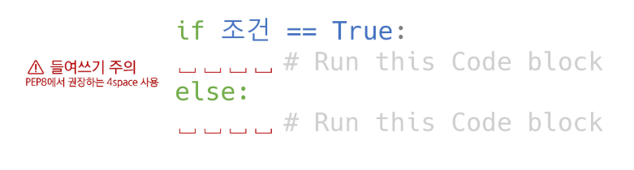
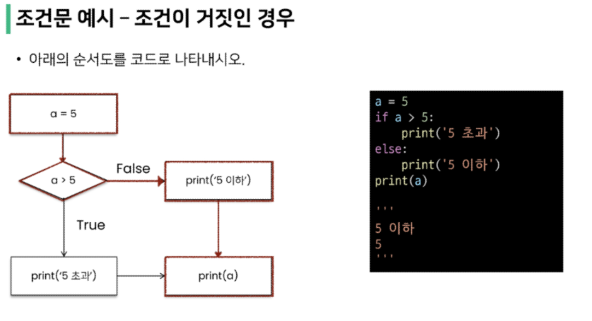
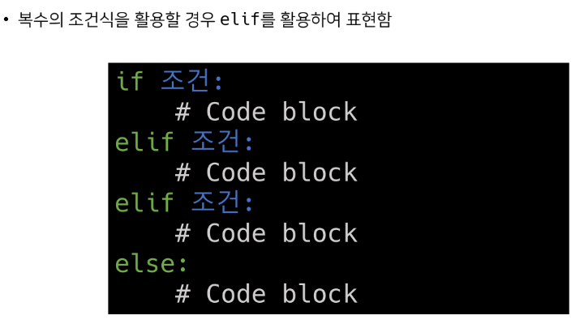
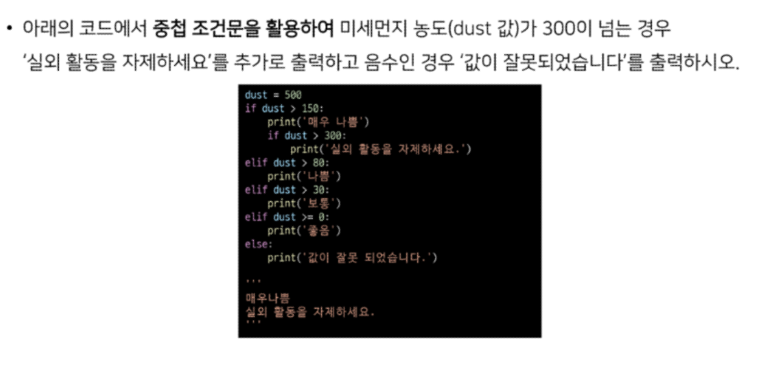

## Python

##### 조건문 반복문 함수 모듈

- 조건문
  - 제어문
    - 파이썬은 기본적으로 위에서부터 아래로 차례대로 명령을 수행
    - 특정 상황에 따라 코드를 선택적으로 실행(분기/조건)하거나 계속하여 실행(반복)하는 제어가 필요함
    - 제어문은 순서도(flowchart)로 표현이 가능
  - 조건문
    - 조건문은 참/거짓을 판단할 수 있는 조건식과 함께 사용
      - 조건이 참인 경우 이후 들여쓰기 되어있는 코드 블록을 실행
      - 이외의 경우 else 이후 들여쓰기 되어있는 코드 블록을 실행
        - else는 선택적으로 활용할 수 있음
        - 
        - 복수 조건문
        - 중첩  조건문
  - 반복문
    - 특정 조건을 만족할 때까지 같은 동작을 계속 반복하고 싶을 때 사용
    - 반복문의 종류
      - while 문
        - 종료 조건에 해당하는 코드를 통해 반복문을 종료시켜야 함
          - 조건이 참인 경우 들여쓰기 되어 있는 코드 블록이 실행됨
          - 코드 블록이 모두 실행되고, 다시 조건식을 검사하며 반복적으로 실행됨
          - while문은 무한 루프를 하지 않도록 종료 조건이 반드시 필요
      - for 문
        - 반복 가능한 객체를 모두 순회하면 종료
        - for문은 시퀀스(string, tuple, list, range)를 포함한 순회 가능한 객체의 요소를 모두 순회
          - 처음부터 끝까지 모두 순회하므로 별도의 종료 조건이 필요하지 않음
        - Iterable
          - 순회할 수 있는 자료형(string, list, dict, tuple, range, set 등)
          - 순회형 함수(range,enumerate)
      - 반복 제어
        - break
          - 반복문을 종료
        - continue
          - continue 이후의 코드 블록은 수행하지 않고, 다음 반복을 수행
        - for-else
          - 끝까지 반복문을 실행한 이후에 else 문 실행
            - break를 통해 중간에 종료되는 경우 else문은 실행되지 않음
        - pass
          - 아무것도 하지 않음(문법적으로 필요하지만, 할 일이 없을 때 사용)

너무 피곤해서 반복문 제어에서 끝!

남은건 내일
