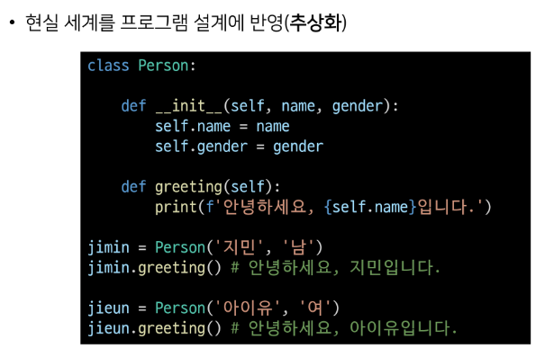
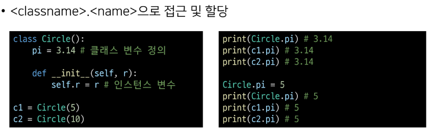
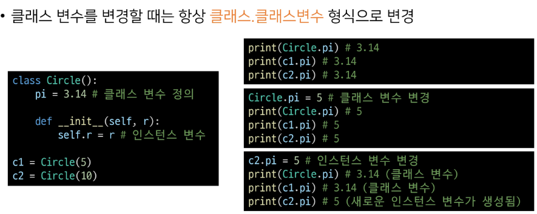
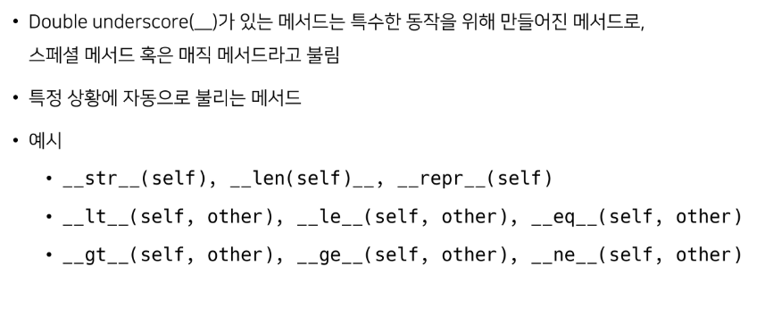
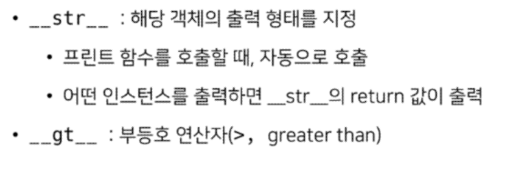

# *객체지향 교수님 노트*

### 이전의 기술이 문제가 있어 문제 해결을 위해 객체지향 패러다임이 나타남

- 절차지향 프로그래밍
  - 내가 호출한 순서대로 일을 하는 것
  - -> 변수가 많아지면 함수를 지정하여 사용
  - -> 함수가 많아지면 클래스를 지정하여 사용
  - -> 객체지향 패러다임의 시작
- 객체지향 프로그래밍(프로그램이 확장함에 따라 등장)
  - 역할
  - 책임
  - 협력
- 추상화 : 자세한 이론이나 원리는 모르지만 사용은 가능함(알려줄 필요 없는 것들을 감춤)
- 캡슐화 : 이론이나 원리를 모르므로 서로 간섭할 수 없음
  - getter : 상태 조회
  - setter : 상태 변경
- 다형성 : 어떤 객체가 와도 상관없이 내가 원하는 결과만 받으면 됨
- 상속 : 결과적으로 묶으면 하나의 클래스로 묶임

#### 예시

```python
a = "123"
b =list(a) # a는 생성자, b는 list의 인스턴스, list : class
print(b)
```

---

- 메서드
  - 인스턴스 메서드
    - 첫 번째는 거의 무조건 self를 사용
  - 클래스 메서드
    - 데코레이터(@classmethod)로 정의하여야만 사용 가능
    - 클래스 변수에 접근하고 싶을 때 사용 (self가 아니라 cls를 사용)
  - 스태틱 메서드
    - 데코레이터(@staticmethod)로 정의하여야만 사용 가능
    - 항상 무언가를 반환하고 싶을 때 사용 (괄호 안에 아무것도 넣지 않음)
  - 메서드 오버라이딩
    - 상속받은 클래스에서 같은 이름의 메서드로 덮어씀 (class Professor(person):)
    - 부모 클래스의 메서드를 실행시키고 싶은 경우 super를 활용 (super().method())

---

# OOP

## 개요

- 객체지향 프로그래밍(OOP)
  - 객체 지향 프로그래밍이란?
  - OOP 기초
    - 객체 / 인스턴스 / 클래스
    - 클래스 메서드
- 객체지향의 핵심 개념
  - 추상화
  - 상속
  - 다형성
  - 캡슐화
- 에러와 예외

---

1. 객체지향 프로그래밍

객체 지향 프로그래밍은 컴퓨터 프로그래밍을 명령어의 목록으로 보는 시각에서 벗어나 여러 개의 독립된 단위, 즉 "객체"들의 모임으로 파악하고자 하는 것이다.

각각의 객체는 메시지를 주고받고, 데이터를 처리할 수 있다.

- 객체지향 프로그래밍이란?

  - 프로그래밍을 여러 개의 독립된 객체들과 그 객체 간의 상호작용으로 파악하는 프로그래밍 방법
  - 예시
    - 콘서트
      - 가수 객체
      - 감독 객체
      - 관객 객체
  - 객체지향 프로그래밍이 필요한 이유

  

  - 객체지향의 장점 / 단점
    - 장점
      - 클래스 단위로 모듈화시켜 개발할 수 있으므로 많은 인원이 참여하는 대규모 소프트웨어 개발에 적합
      - 필요한 부분만 수정하기 쉽기 때문에 프로그램의 유지보수가 쉬움
    - 단점
      - 설계 시 많은 노력과 시간이 필요함
        - 다양한 객체들의 상호 작용 구조를 만들기 위해 많은 시간과 노력이 필요
      - 실행 속도가 상대적으로 느림
        - 절차 지향 프로그래밍이 컴퓨터의 처리구조와 비슷해서 실행 속도가 빠름

- OOP 기초

컴퓨터 과학에서 객체 또는 오브젝트는 클래스에서 정의한 것을 토대로 메모리(실제 저장공간)에 할당된 것으로 프로그램에서 사용되는

데이터 또는 식별자에 의해 참조되는 공간을 의미하며, 변수, 자료 구조, 함수 또는 메서드가 될 수 있다.

- 객체(object)의 특징

  - 타입(type) : 어떤 연산자(operator)와 조작(method)이 가능한가?
  - 속성(attribute) : 어떤 상태(데이터)를 가지는가?
  - 조작법(method) : 어떤 행위(함수)를 할 수 있는가?

  객체(Object) = 속성(Attribute) + 기능(Method)

- 객체와 클래스 문법

  - 클래스 정의		*class MyClass::*
  - 인스턴스 생성    *my_instance = MyClass()*
  - 메서드 호출       *my_instance.my_method()*
  - 속성                    *my_instance.my_attribute*
  - 클래스 선언 내부에서 정리

  

  

- 매직 메서드

  

- 객체의 특수 조작 행위를 지정(함수, 연산자 등)

  - 
