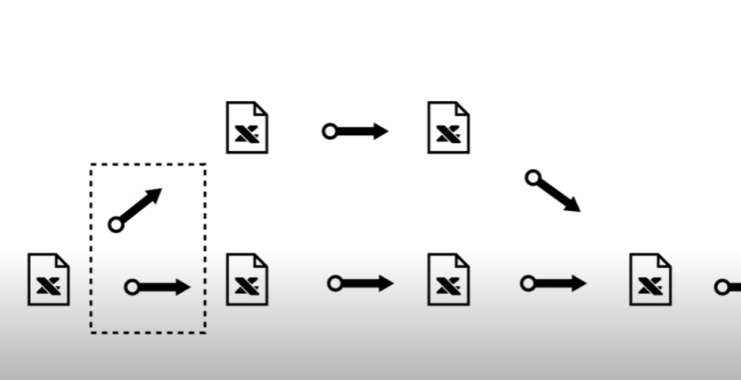
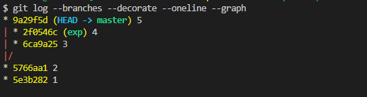
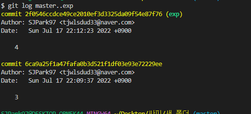
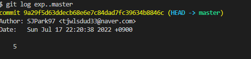
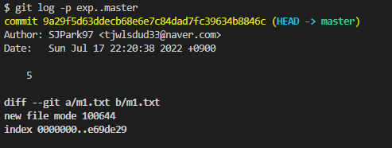
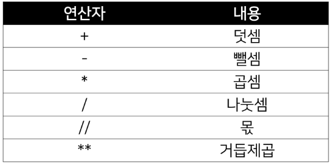
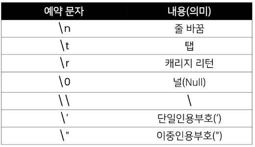
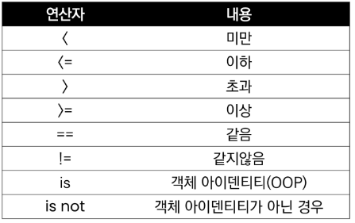
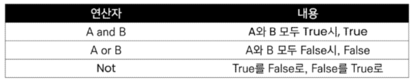
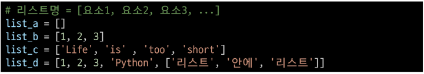

# Today I Learned

---

## At home version

#### DAY 1

- Interface : 서로 다른 두 가지가 만나는 접점 (*HDMI)
  - CLI : Command Line Interface
  - GUI : Graphic User Interface

- Git bash 명령어
  - mkdir : 폴더 생성
  - touch : 파일 생성
  - rm : 파일 지우기
  - rm -r(recursive) : 폴더 지우기
  - ls : 해당 안에 있는 객체 리스트
  - ls -a : 숨김파일까지 보여주기
  - cd : 해당하는 폴더로 이동
  - cd . : 나 자신으로 가기
  - cd .. : 위로가기
- 절대경로 : 정확한 주소
- 상대경로 : 상대적인 위치

---

#  교수님 정리

- 폴더 만들기
  - mkdir test
- 목록
  - ls
  - ls -a
- 이동
  - cd
  - cd ..
  - 절대, 상대 경로
- 파일 만들기
  - touch a.txt
- 삭제
  - rm a.txt (파일)
  - rm -r a (폴더)

---

#### DAY 2

- Markdown (mark up 언어의 일종)
  - 텍스트 기반의 경량 마크업 (mark up : 역할 부여) 언어
- 제목 만드는 법
  - //# 제목 1
  - //## 제목 2
  - //### 제목 3
  - //#### 제목 4
  - //##### 제목 5
- 목록 만드는 법
  - //- 목록입니다 1
  - //- 목록입니다 2
  - //   -서브 목록 1
  - //   -서브 목록 2
  - //     -서브 서브 목록1
- 숫자로 목록 만드는 법
  - //1. 목록입니다 1
  - //2. 목록입니다 2
  - //    1. 서브 목록 1
  - //    2. 서브 목록 2
  - //       1. 서브 서브 목록 1

- 글씨 굵기 굵게 만드는 법

  - //**굵게**

- 글씨 기울이는법

  - //*기울임*

- 취소선 그리는 법

  - //~~취소선~~

- 인라인 코드

  - 'print("hello world")'

- 블록 코드

  - ```python
    for i in range(5):
        print(i)
    ```

- 수평선

  - //---

- 표

  - 마우스 우클릭으로 생성이 가장 쉬움

  - |      |      |      |
    | ---- | ---- | ---- |
    |      |      |      |
    |      |      |      |
    |      |      |      |

---

#### DAY 3

- 누구(한번) -> 초기화(폴더마다) -> 3공간 -> 버전
  - 누구 : git config --global user.name SJPark97
  - 이메일 : git config --global user.email tjwlsdud33@naver.com
  - 초기화 : git init
  - 3 공간 
    - working directory : 작업 폴더
    - stage area : 스테이지 (git add)
    - commit : 커밋 (git commit -m "Why")
    - git status : Git 상태 확인 (제일 중요)
    - git log : 버전 확인
      - git log --oneline : 한 줄로 버전 확인 (간편하게)
    - git checkout (version ID) : 버전 불러오기
    - git reset --hard (version ID) : 버전 돌아가기
    - git commit -am "Why" (add와 commit를 동시에 하는 법)
- git clone : 다운로드 (Remote에 있는 내용을 그대로 다운로드)
  - 폴더 생성
  - git init
  - git remote add origin (URL)
  - 버전, 파일 생성
  - 위 4 단계가 자동으로 됨
- git pull : 업데이트 (git clone로 다운로드 후 변경사항 업데이트)
  - git pull origin master

- README.md : 내 github에 대한 설명 (자동으로 인식하여 출력함)
  - *무조건 맨 처음에 만들어야 함
- .gitignore
  - 남에게 보여주면 안되는 보안 파일 관리 (ignore.txt)
  - 굳이 올리지 않아도 되는 파일
  - *무조건 맨 처음에 만들어야 함 (한 번 버전관리가 된 파일은 무시가 불가능)
  - .gitignore 파일 만든 후 gitignore.io에 접속 후 프로그램 언어, 개발환경, 사용 프로그램, 입력 후 내용 복붙
- 협업하는 사람이 많아지면
  - branch, merge를 이용 (DAY 4에 구글링으로 확인 후 학습 예정)

---

#### DAY 4

###### 자율학습

- git - branch
  - 나무의 가지로 비유
  - 작업이 분기되는 현상 (branch를 만든다)
  - git branch (현재 branch 확인)
  - git branch 이름 (branch를 만든다)
  - git check out 이름 (해당하는 branch로 바꾼다)
    - 
  - git log --branches -- decorate --graph --oneline
    - 
  - git log master...exp (master에는 없고 exp에는 있는 것)
    - 
  - git log exp..master (exp에는 없고 master에는 있는 것)
    - 
  - git log -p exp..master (exp에는 없고 master에는 있는 것과 변경 내용)
    - 
  - Git - branch에서 학습 종료

---

#### DAY 5

###### Python 기초

- 프로그래밍 용어 정리
  - 프로그래밍 : 컴퓨터에게 일을 시키기 위해서 프로그램을 만드는 행위
  - 프로그램 : 컴퓨터가 해야 할 일들의 모음
  - 프로그래머 : 프로그램을 만드는 사람 (소프트웨어 개발자)
  - 소프트웨어 : 엄밀히 따지면 다르지만. 프로그램과 유사한 의미로 사용
  - 코딩 : 엄밀히 따지면 다르지만. 프로그래밍과 유사한 의미로 사용
- Python을 배워야 하는 이유
  - 알고리즘 코딩 테스트에서 Python이 2위를 기록
  - 코딩 테스트의 유형이 다양해지면서, 변칙적인 유형에 대응하기 쉬운 Python이 코딩 테스트에 유리
  - 입사를 위한 코딩 테스트는 Python 추천
- Jupyter Notebook
  - 문법 학습을 위한 최적의 도구로, 소스코드와 함께 실행 결과와 마크다운 저장 가능
  - 웹 플랫폼 킻 어플리케이션으로, 파이썬을 비롯한 다양한 프로그래밍 언어를 지원하며 셀 단위의 실행이 가능한 것이 특징
- 주석
  - 코드를 보다 이해하기 쉽게 만드는 것
  - 요즘은 코드를 다는 것 보다는 클린코드를 사용하는 것을 추천함. 
- 연산자
  - 
- 자료형(Datatype) 분류
  - 수치형 (Numeric Type)
    - int (정수, integer)
    - float (부동소수점, 실수, floating point number)
    - complex (복소수, complex number)
  - 문자열 (String Type)
  - 불린형 (Boolean Type)
  - None
- 진수 표현
  - 2진수 : 0b
  - 8진수 : 0o
  - 16진수 : 0x
- Escape sequence
  - 
- 비교 연산자
  - 
  - 
- 리스트
  - 리스트는 대괄호([]) 혹은 list()를 통해 생성
    - 파이썬에서는 어떠한 자료형도 저장할 수 있으며, 리스트 안에 리스트도 넣을 수 있음
    - 생성된 이후 내용 변경이 가능 -> 가변 자료형
  - 순서가 있는 시퀀스로 인덱스를 통해 접근 가능
    - 값에 대한 접근은 list[i]
- 튜플
  - 
