# 1. Web

1. Web이란?
   1. 웹 사이트의 구성 요소
   2. 웹 표준과 크로스 브라우징
   3. 개발 환경 설정
2. HTML
   1. HTML 기본구조
   2. HTML 문서 구조화
3. CSS
   1. CSS Selectors
   2. CSS 단위
   3. Selectors 심화
   4. Box model
   5. Display
   6. Position

---

## 1. Web이란?

- HTML(구조) : 웹 사이트의 구성 요소
  - 웹 사이트란 브라우저를 통해서 접속하는 웹페이지(문서)들의 모음
  - 웹 페이즈는 글, 그림, 동여상 등 여러가지 정보를 담고 있으며, 마우스로 클릭하면 다른 웹 페이지로 이동하는 '링크'들이 있음. '링크'를 통해 여러 웹 페이지를 연결한 것을 웹 사이트라고 함.
- 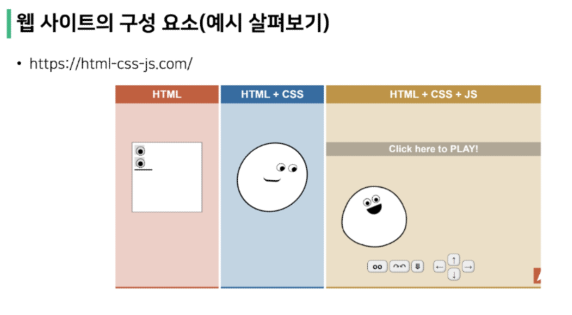
- 웹 사이트와 브라우저
  - 웹 사이트는 브라우저를 통해 동작함
  - 브라우저마다 동작이 약간씩 달라서 문제가 생기는 경우가 많으(파편화)
  - 해결책으로 웹 표준이 등장
- 웹 표준
  - 웹에서 표준적으로 사용되는 기술이나 규칙
  - 어떤 브라우저든 웹 페이지가 동일하게 보이도록 함(크로스 브라우징)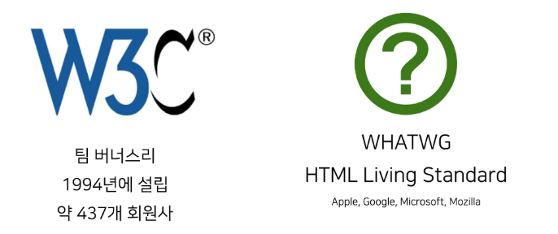
- 개발환경 설정 - Text editor 
  - Visual Studio Code
    - HTML/CSS 코드 작성을 위한 Visual Studio Code 추천 확장 프로그램
      - Open in browser
      - Auto rename tag
      - Highlight Matching Tag
      - Public Document - "Web 사전 준비사항" 확인
        - https://abit.ly/ssafy8-document
  - 크롬 개발자 도구
    - 웹 브라우저 크롬에서 제공하는 개발과 관련된 다양한 기능을 제공
    - 주요 기능
      - Elements - DOM 탐색 및 CSS 확인 및 변경
        - Styles - 요소에 적용된 CSS 확인
        - Computed - 스타일이 계산된 최종 결과
        - Event Listeners - 해당 요소에 적용된 이벤트 (JS)
      - Sources, Network, Performance, Application, Security, Audits 등

---

## 2. HTML? 

- Naver 사이트에 접속해서 개발자 도구를 활용해 CSS를 삭제한다면?

  - HTML만 남은 웹 사이트를 확인할 수 있음

- HTML이란?

  - HTML : Hyper Text Markup Language
    - Hyper Text란? : 참조(하이퍼링크)를 통해 사용자가 한 문서에서 다른 문서로 즉시 접근할 수 있는 텍스트
    - Markup Language : 태그 등을 이용하여 문서나 데이터의 구조를 명시하는 언어
      - 대표적인 예 - HTML, Markdown
      - 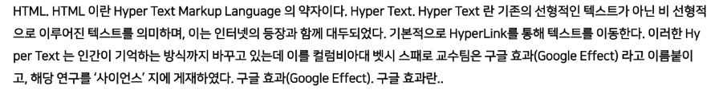
      - 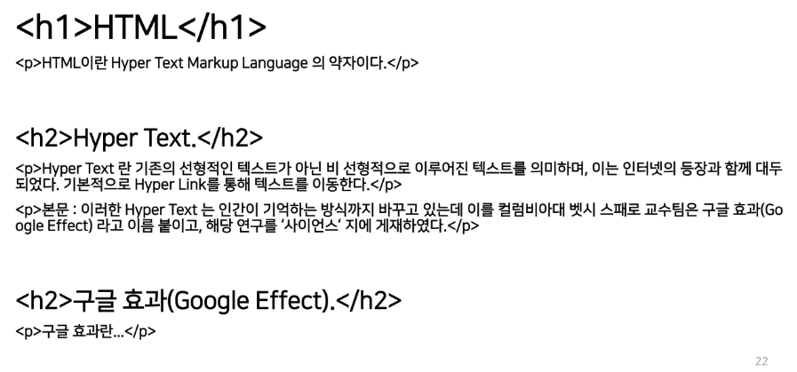
      - 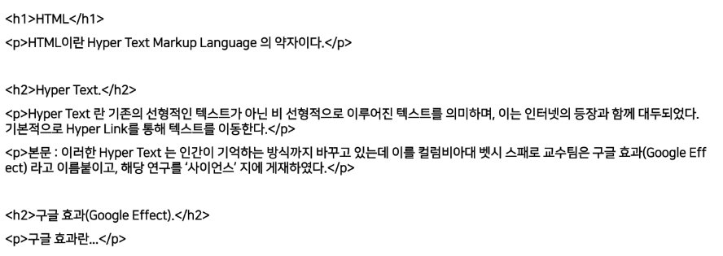

- 웹 페이지를 작성(구조화)하기 위한 언어 : .html (HTML 파일)

  - 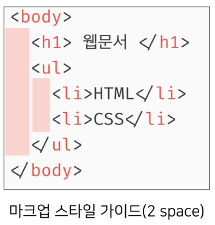

- HTML 기본 구조

  - html : 문서의 최상위(root) 요소

  - head : 문서 메타데이터 요소

    - 문서 제목, 인코딩, 스타일, 외부 파일 로딩 등

    - 일반적으로 브라우저에 나타나지 않는 내용

    - 예시 : 

      #<title> : 브라우저 상단 타이틀

      #<meta> : 문서 레벨 메타데이터 요소

      #<link> : 외부 리소스 연결 요소 (CSS 파일, favicon 등)

      #<script> : 스크립트 요소 (JavaScript 파일/코드)

      #<style> : CSS 직접 작성

      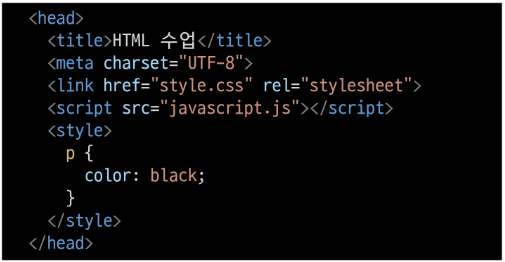

  - body : 문서 본문 요소

    - 실제 화면 구성과 관련된 내용
  
    - 요소 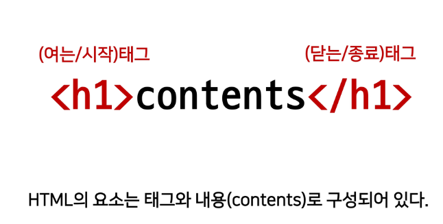
      - HTML 요소는 시작 태그와 종료 태그 그리고 태그 사이에 위치한 내용으로 구성
        - 요소는 태그로 컨텐츠(내용)를 감싸는 것으로 그 정보의 성격과 의미를 정의
        - 내용이 없는 태그들도 존재(닫는 태그가 없음)
          - br, hr, img, input, link, meta
        
      - 요소는 중첩(nested)될 수 있음
        - 요소의 중첩을 통해 하나의 문서를 구조화
        - 여는 태그와 닫는 태그의 쌍을 잘 확인해야함
          - 오류를 반환하는 것이 아닌 그냥 레이아웃이 깨진 상태로 출력되기 대문에, 디버깅이 힘들어 질 수 있음
        - 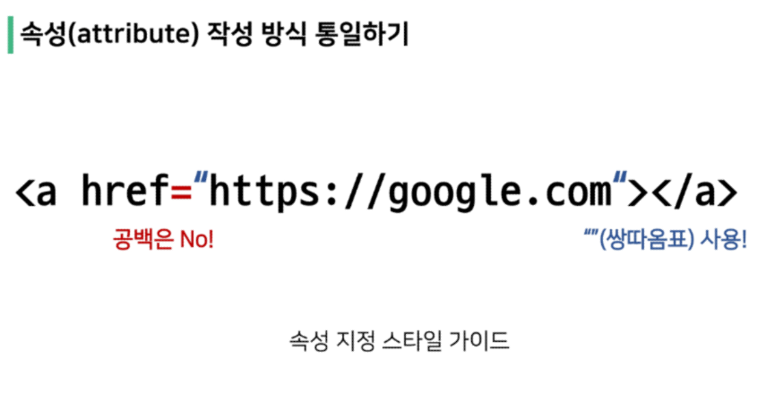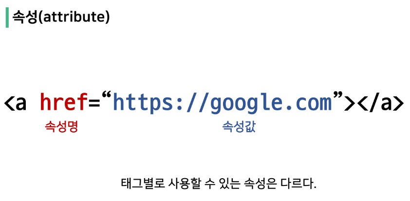
        
      - 속성(attribute)
  
        - 속성을 통해 태그의 부가적인 정보를 설정할 수 있음
  
        - 요소는 속성을 가질 수 있으며, 경로나 크기와 같은 추가적인 정보를 제공
  
        - 요소의 시작 태그에 작성하며 보통 이름과 값이 하나의 쌍으로 존재
  
        - 태그와 상관없이 사용 가능한 속성(HTML Global Attribute)들도 있음
  
          - 모든 HTML 요소가 공통으로 사용할 수 있는 대표적인 속성 (몇몇 요소에는 아무 효과가 없을 수 있음)
  
            id : 문서 전체에서 유일한 고유 식별자 지정
  
            class : 공백으로 구분된 해당 요소의 클래스의 목록 (CSS, JS에서 요소를 선택하거나 접근)
  
            data-* : 페이지에 개인 사용자 정의 데이터를 저장하기 위해 사용
  
            style : inline 스타일
  
            title : 요소에 대한 추가 정보 지정
  
            tabindex : 요소의 탭 순서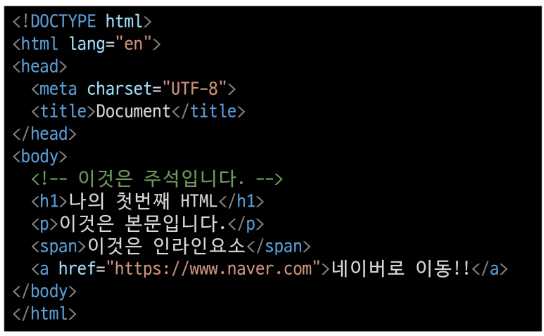
  
    - 시맨틱 태그
  
      - HTML 태그가 특정 목적, 역할 및 의미적 가치를 가지는 것
        - 예를 들어 h1 태그는 "이 페이지에서 최상위 제목"인 텍스트를 감싸는 역할을 나타냄
      - Non semantic 요소로는 div, span 등이 있으며 a, form, table 태그들도 시맨틱 태그로 볼 수 있음
      - HTML5에서는 기존에 단순히 콘텐츠의 구획을 나타내기 위해 사용한 div 태그를 대체하여 사용하기 위해 의미론적 요소를 담은 태그들이 추가됨
      - 대표적인 시맨틱 태그 목록
        - header : 문서 전체나 섹션의 헤더(머리말 부분)
        - nav : 내비게이션
        - aside : 사이드에 위치한 공가느 메인 콘텐츠와 관련성이 적은 콘텐츠
        - article : 문서, 페이지, 사이트 안에서 독립적으로 구분되는 영역
        - footer : 문서 전체나 섹션의 푸터(마지막 부분)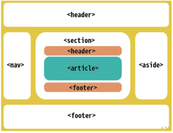
        - 