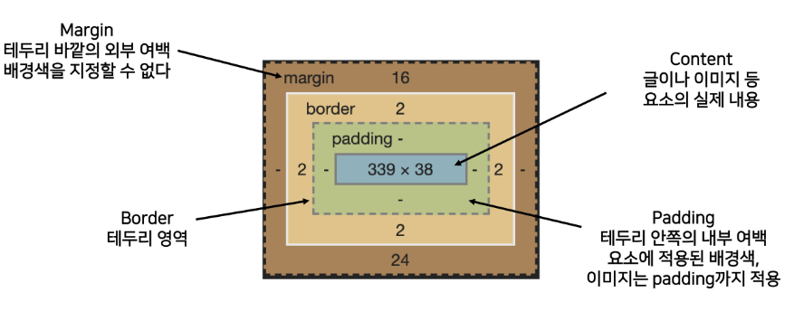

# web 교수님 노트

#### HTML

HTML는 웹 브라우저에서 DOM Tree로 읽힌다.

head 안에 자식들(2스페이스 들여쓰기)

body 안에 자식들(2스페이스 들여쓰기)

인라인 요소는 글자처럼취급

블록 요소는 한 줄 모두 사용

---

### CSS : 스타일을 지정하기 위한 언어

선택자 : {color:blue;font-size:15px;}

- 기본 선택자
  - 전체 선택자 : * {}
  - 요소 선택자 : h1 {}
  - 클래스 선택자 : .green {}
  - 아이디 선택자 : #purple {}
  - 속성 선택자 : 설명 x

결합자 : 

- 자손 결합자(공백) : .box p {} (box 안에 p를 선택) 여러 단계 내려감
- 자식 결합자(>) : .box>p {} (box 안에 p를 선택) 한 단계만 내려감
- 일반 형제 결합자(~) : p ~ p {} (p뒤에 있는 모든 p) 바로 뒤가 아니여도 적용 됨
- 인접 형제 결합자(+) : p + p {} (들여쓰기가 되지 않은 p 다음의 모든 p) 바로 뒤만 적용 됨 

display : 모든 요소는 네모이고, 위에서부터 아래로, 왼쪽에서 오른쪽으로 쌓인다.

- Margin(바깥), Border(경계선), Padding(경계선과 내용 사이), Content(내용)
- 
- block
  - 줄 바꿈이 일어나는 요소
  - 화면 크기 전체의 가로 폭을 차지한다.
  - 블록 레벨 요소 안에 인라인 레벨 요소가 들어갈 수 있음.
- inline
  - 줄 바꿈이 일어나지 않는 행의 일부 요소
  - content 너비만큼 가로 폭을 차지한다.
  - width, height, margin-top, margin-bottom을 지정할 수 없다.
  - 상하 여백은 line-height로 지정한다.
- inline-block
  - 내부적으로는 block이나 겉에서 볼 때는 inline처럼 보인다.
  - block과 inline 레벨 요소의 특징을 모두 가짐
  - width, height, margin-top, margin-bottom을 지정할 수 있다.
- none
  - 해당 요소를 화면에 표시하지 않고, 공간조차 부여되지 않음
  - 이와 비슷한 visibility:hidden은 해당 요소가 공간은 차지하나 화면에 표시만 하지 않는다.

position : 

- 문서 상에서 요소의 위치를 지정
- static : 모든 태그의 기본 값(기준 위치)
  - 일반적인 요소의 배치 순서에 따름(좌측 상단)
  - 부모 요소 내에서 배치될 때는 부모 요소의 위치를 기준으로 배치 됨
- 아래는 좌표 프로퍼티를 사용하여 이동 가능
  1. relative : 상대 위치 (static일 때의 공간은 남겨두고 이동한다.)
     - 자기 자신의 static 위치를 기준으로 이동 (normal flow 유지)
     - 레이아웃에서 요소가 차지하는 공간은 static일 때와 같음 (normal position 대비 offset)
  2. absolute : 절대 위치 (static일 때의 공간도 x, 아무 공간도 차지하지 않는다. 허공에 떠있다.)
     - 요소를 일반적인 문서 흐름에서 제거 후 레이아웃에 공간을 차지하지 않음 (normal flow에서 벗어남)
     - static이 아닌 가장 가까이 있는 부모/조상 요소를 기준으로 이동 (없는 경우 브라우저 화면 기준으로 이동)
     - ***부모가 static이 아닌 곳을 기준으로 이동하기 때문에 그것을 주의깊게 확인하자***
  3. fixed : 고정 위치
     - 요소를 일반적인 문서 흐름에서 제거 후 레이아웃에 공간을 차지하지 않음(normal flow에서 벗어남)
     - 부모 요소와 관계없이 viewport를 기준으로 이동
       - 스크롤 시에도 항상 같은 곳에 위치함
  4. sticky : 스크롤에 따라 static -> fixed로 변경
     - 속성을 적용한 박스는 평소에 문서 안에서 position: static 상태와 같이 일반적인 흐름에 따르지만 스크롤 위치가 임계점에 이르면 position: fixed와 같이 박스를 화면에 고정할 수 있는 속성