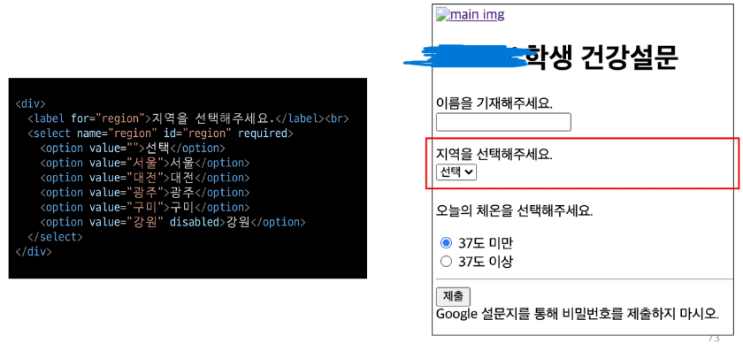

HTML의 요소는 태그와 내용으로 구성

요소는 중첩으로 쌓을 수 있음

태그별로 사용 할 수 있는 속성은 다르다

```html
<a></a> href 속성을 활용하여 다른 URL로 연결하는 하이퍼링크 생성
<b></b> 굵은 글씨 요소
<i></i> 기울임 글씨 요소
<br> 줄 바꿈 생성
 src 속성을 활용하여 이미지 표현
<span></span> 의미 없는 인라인 레벨 컨테이너
<p></p> 하나의 문단
<hr> 수평선
<ol></ol> 순서가 있는 리스트
<ul></ul> 순서가 없는 리스트
<pre></pre> 작성한 내용 그대로 표현 (고정폭 글꼴이 사용되고 공백문자를 유지)
<blockquote></blockuote> 텍스트가 긴 인용문 (주로 들여쓰기를 한 것으로 표현됨)
<div></div> 의미 없는 블록 레벨 컨테이너
```

```html
# input 유형-일반
text : 일반 텍스트 입력
password : 입력 시 값이 보이지 않고 문자를 특수기호(*)로 표현
email : 이메일 형식이 아닌 경우 form 제출 불가
number : min, max, step 속성을 활용하여 숫자 범위 설정 가능
file : accept속성을 활용하여 파일 타입 지정가능

checkbox : 다중 선택
radio : 단일 선택
```



---

CSS

클래스선택자는 여러개 적용 가능

아이디선택자는 여러개 사용해도 동작하지만 단일 아이디를 사용하는 것을 권함

중요도

!important > 인라인 > id > class, 속성, pseudo-class > 요소, pseudo-element

같은 요소일 경우 밑에 지정한 것이 적용됨


상속 되는 요소

font, color, text-align, opacty, visibility

상속 되지 않는 요소

box model 관련 요소 : width, height, margin, padding, border, box-sizing, display 등

position 관련 요소 : position, top/right/bottom/left, z-index 등


CSS 기본 크기 단위 : rem (16px)

em은 부모 요소의 크기 단위를 기본으로 바뀜 (부모 요소의 크기에 따라 바뀌기 때문에 기본 크기 단위가 아님)


크기 단위 (viewport)

px : 브라우저의 크기가 바뀌어도 그대로 적용

vw : 브라우저의 크기에 따라 크기가 변함


결합자

자손 결합자 (띄어쓰기)

자식 결합자 (>)

일반 형제 결합자 (~)

인접 형제 결합자 (+)


HTML 요소는 box 형태로 되어있음

하나의 box는 네 영역으로 이루어짐

​	margin : 바깥 여백 (영역 크기 빼고 아무것도 지정 불가)

​	border : 테두리 영역 (테두리 선)

​	padding : 테두리 영역과 내용 사이의 여백 (background-color, img)

​	content : 요소의 실제 내용 (글이나 이미지)


box-sizing은 content-box 즉 padding 밖의 영역들은 신경쓰지 않음

고로 우리가 보는 실제 박스의 크기를 지정하고 싶은 경우 box-sizing을 border-box로 설정


display : block

​	줄 바꿈이 일어나는 요소

​	화면 크기 전체의 가로 폭을 차지함

​	블록 레벨 요소 안에 인라인 레벨 요소가 들어갈 수 있음

display : inline

​	줄 바꿈이 일어나지 않는 요소

​	content 너비만큼 가로 폭을 차지함

​	상하좌우 크기 설정이 불가능함

​	상하 여백은 line-height로 지정

display : inline-block

​	block과 inline 레벨 요소의 특징을 모두 가짐

​	inline처럼 한 줄에 표시할 수 있고, block처럼 상하좌우 크기 설정이 가능함

display : none

​	해당 요소를 화면에 표시하지 않고, 공간조차 부여되지 않음

​	display : hidden은 공간은 부여되나 화면에는 보이지 않음


CSS position

1. relative : 상대 위치
   - 자기 자신의 static 위치를 기준으로 이동 (normal flow 유지)
   - 레이아웃에서 요소가 차지하는 공간은 static일 때와 같음
2. absolute : 절대 위치
   - 요소를 static이 아닌 가장 가까이 있는 부모/조상 요소를 기준으로 이동
   - 이동 후 요소가 차지하는 공간은 없음
3. fixed : 고정 위치
   - 부모 요소와 관계없이 viewpoint를 기준으로 이동
     - 스크롤 시에도 항상 같은 곳에 위치함
   - 이동 후 요소가 차지하는 공간은 없음
4. sticky : 스크롤에 따라 static -> fixed로 변경
   - 평소에는 문서 안에서 position : static 상태와 같이 고정되어 있지만 스크롤이 끝에 다다르면 fixed와 같이 박스를 화면에 고정시킴


CSS Flexible Box Layout

- 축
  - main axis (메인 축) : justify-content
  - cross axic (교차 축) : align-content
- 구성 요소
  - Flex Container (부모 요소)
  - Flex Item (자식 요소)


Flexbox를 사용해야 하는 이유

이전까지 Normal Flow를 벗어나는 수단은 Float 혹은 Position 뿐이었고 수동 값 부여 없이

수직 정렬, 아이템의 너비와 높이 혹은 간격을 동일하게 배치하기 어려웠다


Flex 속성

- 배치 설정
  - flex-direction
  - flex-wrap
- 공간 나누기
  - justify-content (main axis)
  - align-content (cross axis)
- 정렬
  - align-items (모든 아이템을 cross axis 기준으로)
  - align-self (개별 아이템)


메인 축, 교차 축 공통

- flex-start : 아이템들을 시작점으로
- flex-end : 아이템들을 끝지점으로
- center : 아이템들을 중앙으로
- space-between : 아이템을 사이의 간격을 균일하게 분배 (좌우는 끝지점으로)
- space-around : 아이템들을 둘러싼 영역을 균일하게 분배 (영역-아이템-영역 #*영역이 균일하다*)
- space-evenly : 아이템 간 간격을 균일하게 분배 (영역-아이템-영역-아이템-영역)

개별 아이템에 적용 (교차 축 기준)

- stretch : 컨테이너를 가득 채움
- flex-start : 위
- flex-end : 아래
- center : 가운데
- baseline : 텍스트 baseline에 기준선을 맞춤
- grow : 남은 영역을 분배
- order : 배치 순서


수직 수평 정렬


방법 1 (컨테이너 설정)

justify-content : center;

align-items : center;


방법 2 (아이템 설정)

margin : auto;

---

# Bootstrap (제일 중요한듯)

### spacing

- 슬라이싱 첫번째 요소
  - m - for classes that set margin
  - p - for classes that set padding
- 슬라이싱 두번째 요소
  - t - for classes that set margin-top or padding-top
  - b - for classes that set margin-bottom or padding-bottom
  - s - for classes that set margin-left or padding-left
  - e - for classes that set margin-right or padding-right
  - x - for classes that set both *-left and *-right
  - y - for classes that set both *-top and *-bottom
  - blank - for classes that set a margin or padding on all 4 sides of the element
- 슬라이싱 세번쨰 요소
  - 0~5 (1 : 0.25rem, 2 : 0.5rem, 3 : 1rem, 4 : 1.5rem, 5 : 3rem)
  - auto - for classes that set the margin to auto

### Gird system

크기에 따라 보이지 않게 하는 것

d-none : 보이지 않게 하기

d-~-none : ~위에서 보이지 않게 하기

그냥 보이게 하는건 기본이라 없음

d-~-block : ~위에서 보이게 하기

~ 단위

sm : 576px

md : 768px

lg : 992px

xl : 1200px

xxl : 1400px


